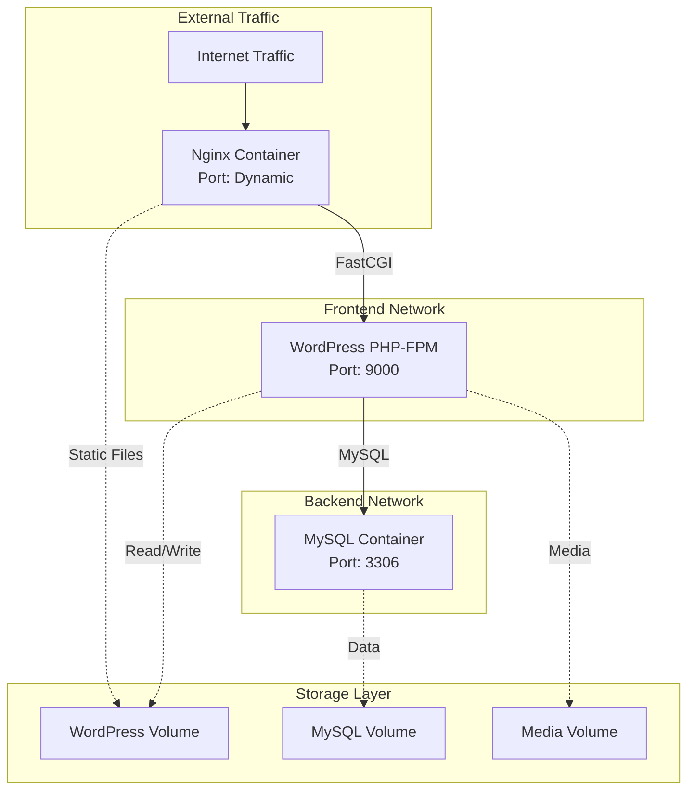

# Enterprise WordPress Docker Stack - Technical Resources

> **Complete Technical Documentation | Configuration Reference | Performance Tuning**

This document provides comprehensive technical documentation for the enterprise-grade WordPress Docker stack with dynamic configuration.

## 📋 Table of Contents

- [Technical Architecture](#technical-architecture)
- [Configuration Reference](#configuration-reference)
- [Performance Tuning](#performance-tuning)
- [Security Implementation](#security-implementation)
- [Monitoring & Observability](#monitoring--observability)
- [Database Administration](#database-administration)
- [Container Management](#container-management)
- [Troubleshooting Guide](#troubleshooting-guide)
- [Advanced Operations](#advanced-operations)

## 🏗️ Technical Architecture

### **Dynamic Configuration System**

The entire stack is controlled by environment variables, providing complete flexibility and multi-project support:

```bash
# Single configuration point
PROJECT_NAME=devkraken

# Auto-generates all names:
# - Container Names: devkraken_app, devkraken_mysql, devkraken_nginx
# - Image Names: devkraken-wordpress, devkraken-mysql, devkraken-nginx  
# - Volume Names: devkraken_wordpress_data, devkraken_mysql_data
# - Database Name: devkraken_db
# - Database User: devkraken_user
```

### **Container Resource Allocation**

| Service | CPU Limit | Memory Limit | Memory Reservation |
|---------|-----------|--------------|-------------------|
| **Nginx** | 0.25 cores | 128MB | 64MB |
| **WordPress** | 1.0 cores | 512MB | 256MB |
| **MySQL** | 1.0 cores | 1GB | 512MB |

### **Network Architecture**



## ⚙️ Configuration Reference

### **Complete Environment Variables**

#### **Project Configuration**
```bash
# Core Identity
PROJECT_NAME=devkraken              # Master variable - controls all naming
ENVIRONMENT=development             # development|production

# Network Configuration  
NGINX_EXTERNAL_PORT=8044           # External web access port
MYSQL_EXTERNAL_PORT=3306           # MySQL external access (dev only)
```

#### **WordPress Configuration**
```bash
# WordPress Core
WORDPRESS_VERSION=6.6              # WordPress version
WORDPRESS_MEMORY_LIMIT=256M        # PHP memory limit
WORDPRESS_MAX_MEMORY_LIMIT=512M    # Emergency memory limit

# WordPress Database
MYSQL_DATABASE=${PROJECT_NAME}_db   # Auto-generated database name
MYSQL_USER=${PROJECT_NAME}_user     # Auto-generated user name
MYSQL_PASSWORD=wordpress_pass123    # Database password
MYSQL_ROOT_PASSWORD=root_pass123    # Root password

# WordPress Security Keys (Auto-generated)
WORDPRESS_AUTH_KEY=generated_key
WORDPRESS_SECURE_AUTH_KEY=generated_key
WORDPRESS_LOGGED_IN_KEY=generated_key
WORDPRESS_NONCE_KEY=generated_key
WORDPRESS_AUTH_SALT=generated_salt
WORDPRESS_SECURE_AUTH_SALT=generated_salt
WORDPRESS_LOGGED_IN_SALT=generated_salt
WORDPRESS_NONCE_SALT=generated_salt
```

#### **PHP-FPM Configuration**
```bash
# Process Management
PHP_MAX_CHILDREN=10                # Total worker processes
PHP_START_SERVERS=2                # Initial workers on startup
PHP_MIN_SPARE_SERVERS=1            # Minimum idle workers
PHP_MAX_SPARE_SERVERS=3            # Maximum idle workers
PHP_MAX_REQUESTS=1000              # Requests before process restart

# Memory & Limits
PHP_MEMORY_LIMIT=256M              # Script memory limit
PHP_UPLOAD_MAX_FILESIZE=64M        # Upload file size limit
PHP_POST_MAX_SIZE=64M              # POST data size limit
PHP_MAX_EXECUTION_TIME=300         # Script execution timeout
PHP_MAX_INPUT_VARS=3000            # Input variable limit

# Error Handling
PHP_DISPLAY_ERRORS=Off             # Display errors (Off for production)
PHP_LOG_ERRORS=On                  # Log errors
PHP_ERROR_LOG=/var/log/php_errors.log
```

#### **MySQL Configuration**
```bash
# Performance Tuning
MYSQL_INNODB_BUFFER_POOL_SIZE=128M # InnoDB buffer pool
MYSQL_MAX_CONNECTIONS=30           # Maximum connections
MYSQL_QUERY_CACHE_SIZE=16M         # Query cache size
MYSQL_SLOW_QUERY_TIME=2            # Slow query threshold (seconds)

# Authentication & Security
MYSQL_AUTHENTICATION_POLICY=mysql_native_password  # WordPress compatible
MYSQL_REDO_LOG_CAPACITY=67108864   # Modern InnoDB redo log setting

# Storage Engine
MYSQL_DEFAULT_STORAGE_ENGINE=InnoDB
MYSQL_INNODB_FILE_PER_TABLE=1
MYSQL_INNODB_USE_NATIVE_AIO=0      # Required for Docker

# Binary Logging
MYSQL_LOG_BIN=ON                   # Enable binary logging
MYSQL_EXPIRE_LOGS_DAYS=7           # Log retention period
```

### **MySQL 8.0+ Modern Configuration**

MySQL 8.0+ optimized settings for WordPress deployments:

| Setting | Value | Purpose |
|---------|-------|---------|
| `--host-cache-size=0` | Disabled | Optimized for Docker networking |
| `--authentication-policy` | Configurable | Modern authentication methods |
| `--innodb-redo-log-capacity` | 67108864 | InnoDB redo log optimization |
| `--pid-file` | `/var/lib/mysql/mysqld.pid` | Secure PID file location |

### **Authentication Options**

```bash
# WordPress Compatible (default) - no WordPress code changes needed
MYSQL_AUTHENTICATION_POLICY=mysql_native_password

# More Secure - may require WordPress updates for full compatibility
MYSQL_AUTHENTICATION_POLICY=caching_sha2_password
```

#### **Nginx Configuration**
```bash
# Caching
NGINX_FASTCGI_CACHE_SIZE=50m       # FastCGI cache size
NGINX_FASTCGI_CACHE_INACTIVE=30m   # Cache inactive timeout
NGINX_FASTCGI_CACHE_VALID=60m      # Cache valid time

# Rate Limiting
NGINX_LOGIN_RATE_LIMIT=1r/s        # Login attempt rate limit
NGINX_GLOBAL_RATE_LIMIT=10r/s      # Global request rate limit

# Upload Limits
NGINX_CLIENT_MAX_BODY_SIZE=100M    # Maximum upload size
NGINX_CLIENT_BODY_TIMEOUT=60s      # Upload timeout

# Worker Configuration
NGINX_WORKER_PROCESSES=auto        # Worker processes
NGINX_WORKER_CONNECTIONS=1024      # Connections per worker
```

### **Dynamic Image Building**

Each project gets custom-built images with project-specific naming:

```dockerfile
# Auto-generated image names:
${PROJECT_NAME}-wordpress:latest   # Custom WordPress + PHP-FPM
${PROJECT_NAME}-mysql:latest       # Custom MySQL with optimizations
${PROJECT_NAME}-nginx:latest       # Custom Nginx with caching
```

## 🚀 Performance Tuning

### **PHP OPcache Configuration**

```ini
# OPcache Settings (Built into WordPress image)
opcache.enable=1
opcache.memory_consumption=256
opcache.interned_strings_buffer=8
opcache.max_accelerated_files=10000
opcache.revalidate_freq=2
opcache.fast_shutdown=1
```

### **Nginx FastCGI Caching**

```nginx
# FastCGI Cache Configuration
fastcgi_cache_path /var/cache/nginx/fastcgi 
    levels=1:2 
    keys_zone=wordpress:50m 
    inactive=30m 
    max_size=1g;

# Cache Rules
location ~ \.php$ {
    fastcgi_cache wordpress;
    fastcgi_cache_valid 200 301 302 60m;
    fastcgi_cache_valid 404 1m;
    fastcgi_cache_bypass $skip_cache;
    fastcgi_no_cache $skip_cache;
}
```

### **MySQL Optimization**

```sql
-- Key MySQL Settings
SET GLOBAL innodb_buffer_pool_size = 128*1024*1024;  -- 128MB
SET GLOBAL max_connections = 30;
SET GLOBAL query_cache_size = 16*1024*1024;          -- 16MB
SET GLOBAL slow_query_log = 1;
SET GLOBAL long_query_time = 2;
```

## 🔒 Security Implementation

### **Multi-Layer Security Architecture**

1. **Network Isolation**: Backend services isolated from internet
2. **Container Security**: Non-privileged execution with secure file ownership
3. **WordPress Hardening**: File editing disabled, security configurations
4. **Rate Limiting**: Login and global request protection
5. **Security Headers**: OWASP-compliant HTTP headers

### **Security Headers Implementation**

```nginx
# OWASP Security Headers
add_header X-Frame-Options "SAMEORIGIN" always;
add_header X-XSS-Protection "1; mode=block" always;
add_header X-Content-Type-Options "nosniff" always;
add_header Referrer-Policy "no-referrer-when-downgrade" always;
add_header Content-Security-Policy "default-src 'self' 'unsafe-inline' 'unsafe-eval' *.wordpress.org *.w.org *.gravatar.com" always;
add_header Strict-Transport-Security "max-age=31536000; includeSubDomains" always;
```

### **WordPress Security Configuration**

```php
// WordPress Security Hardening
define('DISALLOW_FILE_EDIT', true);        // Disable file editing
define('DISALLOW_FILE_MODS', true);        // Disable plugin/theme installation
define('WP_AUTO_UPDATE_CORE', false);       // Disable automatic updates
define('AUTOMATIC_UPDATER_DISABLED', true); // Disable all auto updates
define('FORCE_SSL_ADMIN', true);           // Force SSL for admin
define('WP_DEBUG', false);                 // Disable debug mode
```

## 📊 Monitoring & Observability

### **Health Check System**

Each container implements comprehensive health checks:

```bash
# WordPress Health Check
healthcheck:
  test: ["CMD", "curl", "-f", "http://localhost:9000/ping"]
  interval: 30s
  timeout: 10s
  retries: 3
  start_period: 10s

# MySQL Health Check  
healthcheck:
  test: ["CMD", "mysqladmin", "ping", "-h", "localhost"]
  interval: 30s
  timeout: 10s
  retries: 3

# Nginx Health Check
healthcheck:
  test: ["CMD", "nginx", "-t"]
  interval: 30s
  timeout: 10s
  retries: 3
```

### **Monitoring Metrics**

The monitoring system tracks:

| Metric | Threshold | Action |
|--------|-----------|--------|
| **CPU Usage** | >80% | Alert + Scale |
| **Memory Usage** | >85% | Alert + Investigation |
| **Disk Usage** | >90% | Alert + Cleanup |
| **Response Time** | >2s | Alert + Cache Clear |
| **Error Rate** | >5% | Alert + Log Analysis |

### **Log Aggregation**

```bash
# Log locations and rotation
/var/log/nginx/           # Nginx access and error logs
/var/log/php8/           # PHP-FPM logs
/var/log/mysql/          # MySQL logs
/var/www/html/wp-content/debug.log  # WordPress debug log
```

## 🗄️ Database Administration

### **MySQL Management Commands**

```bash
# Database Connection (Development)
mysql -h localhost -P 3306 -u ${PROJECT_NAME}_user -p

# Performance Analysis
SHOW FULL PROCESSLIST;
SHOW ENGINE INNODB STATUS;
SHOW GLOBAL STATUS LIKE 'Slow_queries';

# Database Optimization
OPTIMIZE TABLE wp_posts;
ANALYZE TABLE wp_options;
```

### **Backup Strategy**

```bash
# Automated Backup (Daily)
mysqldump -u root -p${MYSQL_ROOT_PASSWORD} \
  --single-transaction \
  --routines \
  --triggers \
  ${MYSQL_DATABASE} > backup_$(date +%Y%m%d_%H%M%S).sql

# WordPress Files Backup
tar -czf wp_files_$(date +%Y%m%d_%H%M%S).tar.gz \
  /var/www/html/wp-content/
```

## 🐳 Container Management

### **Container Lifecycle**

```bash
# Build custom images
docker compose build

# Start with project name override
PROJECT_NAME=myclient make start

# Scale services
docker compose up --scale wordpress=3

# Update containers
docker compose pull && docker compose up -d

# Clean unused resources
docker system prune -a
```

### **Volume Management**

```bash
# List project volumes
docker volume ls | grep ${PROJECT_NAME}

# Backup volume data
docker run --rm -v ${PROJECT_NAME}_mysql_data:/data \
  -v $(pwd)/backups:/backup alpine \
  tar czf /backup/mysql_data_backup.tar.gz -C /data .

# Restore volume data
docker run --rm -v ${PROJECT_NAME}_mysql_data:/data \
  -v $(pwd)/backups:/backup alpine \
  tar xzf /backup/mysql_data_backup.tar.gz -C /data
```

## 🔧 Troubleshooting Guide

### **Common Issues & Solutions**

#### **Container Won't Start**
```bash
# Check container status
docker compose ps

# View container logs
docker compose logs [service_name]

# Inspect container configuration
docker compose config

# Check resource usage
docker stats
```

#### **Performance Issues**
```bash
# Check PHP-FPM status
docker compose exec wordpress curl http://localhost:9000/status

# Monitor MySQL performance
docker compose exec mysql mysqladmin processlist

# Clear FastCGI cache
docker compose exec nginx rm -rf /var/cache/nginx/fastcgi/*
```

#### **Permission Problems**
```bash
# Fix WordPress permissions
docker compose exec wordpress find /var/www/html -type d -exec chmod 755 {} \;
docker compose exec wordpress find /var/www/html -type f -exec chmod 644 {} \;
docker compose exec wordpress chown -R www-data:www-data /var/www/html
```

#### **Database Connection Issues**
```bash
# Test MySQL connectivity
docker compose exec wordpress mysqladmin ping -h mysql

# Check MySQL logs
docker compose logs mysql

# Verify database exists
docker compose exec mysql mysql -u root -p -e "SHOW DATABASES;"
```

### **Debug Mode Operations**

```bash
# Enable WordPress debug mode
echo "WP_DEBUG=true" >> .env
echo "WP_DEBUG_LOG=true" >> .env
docker compose restart wordpress

# View live error logs
docker compose exec wordpress tail -f /var/www/html/wp-content/debug.log

# Enable MySQL general log
docker compose exec mysql mysql -u root -p -e "SET GLOBAL general_log = 'ON';"
```

## 🚀 Advanced Operations

### **Multi-Environment Deployment**

```bash
# Production Environment
PROJECT_NAME=mycompany-prod \
ENVIRONMENT=production \
NGINX_EXTERNAL_PORT=80 \
make start

# Staging Environment  
PROJECT_NAME=mycompany-staging \
ENVIRONMENT=staging \
NGINX_EXTERNAL_PORT=8080 \
make start

# Development Environment
PROJECT_NAME=mycompany-dev \
ENVIRONMENT=development \
NGINX_EXTERNAL_PORT=8090 \
make start
```

### **Custom Image Modifications**

To modify custom images, edit the Dockerfiles:

```bash
# WordPress customizations
vim docker/wordpress/Dockerfile

# Nginx customizations  
vim docker/nginx/Dockerfile

# MySQL customizations
vim docker/mysql/Dockerfile

# Rebuild with changes
docker compose build --no-cache
```

### **Performance Benchmarking**

```bash
# Load testing with Apache Bench
ab -n 1000 -c 10 http://localhost:${NGINX_EXTERNAL_PORT}/

# WordPress-specific testing
curl -o /dev/null -s -w "Total: %{time_total}s\n" \
  http://localhost:${NGINX_EXTERNAL_PORT}/

# Database performance testing
docker compose exec mysql mysqlslap \
  --user=root --password=${MYSQL_ROOT_PASSWORD} \
  --auto-generate-sql --auto-generate-sql-load-type=mixed \
  --concurrency=10 --iterations=10
```

### **Security Auditing**

```bash
# Container security scan
docker scan ${PROJECT_NAME}-wordpress:latest

# WordPress security check
docker compose exec wordpress wp core verify-checksums

# File permission audit
docker compose exec wordpress find /var/www/html -type f -perm 777

# Network security test
nmap -sT localhost -p ${NGINX_EXTERNAL_PORT}
```

## 📚 Reference Links

### **Official Documentation**
- [Docker Compose File Reference](https://docs.docker.com/compose/compose-file/)
- [WordPress Developer Documentation](https://developer.wordpress.org/)
- [Nginx Configuration Reference](https://nginx.org/en/docs/)
- [MySQL 8.0 Reference Manual](https://dev.mysql.com/doc/refman/8.0/en/)

### **Security Resources**
- [OWASP Container Security](https://owasp.org/www-project-container-security/)
- [WordPress Security Codex](https://wordpress.org/support/article/hardening-wordpress/)
- [Nginx Security Guide](https://nginx.org/en/docs/http/securing_nginx.html)

### **Performance Optimization**
- [WordPress Performance Optimization](https://wordpress.org/support/article/optimization/)
- [PHP-FPM Tuning Guide](https://www.php.net/manual/en/install.fpm.configuration.php)
- [MySQL Performance Tuning](https://dev.mysql.com/doc/refman/8.0/en/optimization.html)

---

**Last Updated**: $(date +"%Y-%m-%d")  
**Stack Version**: WordPress 6.6 + PHP 8.3 + MySQL 8.0 + Nginx 1.24  
**Configuration**: Fully Dynamic with Custom Images 